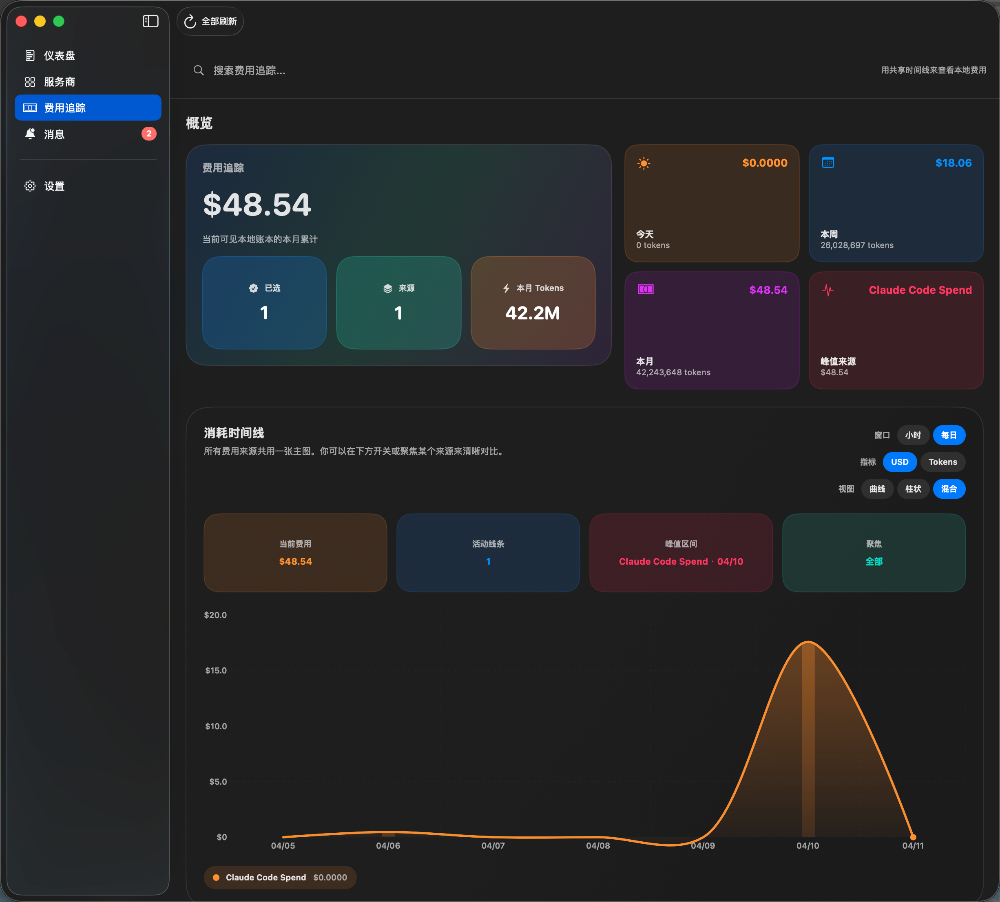

# AIUsage

  

  <strong>A local-first macOS dashboard for AI quotas, multi-account monitoring, and spend visibility.</strong>

  <a href="README.zh-CN.md">中文说明</a> · <strong>English</strong>

  
  
  
  

  

AIUsage is a macOS app for monitoring AI subscription quotas, account status, refresh windows, and local usage cost.

## Features

| Feature | Description |
| --- | --- |
| `Provider dashboard` | View quota status for Codex, Copilot, Cursor, Antigravity, Kiro, Warp, Gemini CLI, Amp, Droid, and local Claude Code spend in one app |
| `Multi-account management` | Keep multiple accounts under one provider and refresh them independently |
| `Account activation` | Switch the active CLI account for Codex and Gemini CLI with one click — auth files are converted and replaced automatically |
| `Dual quota windows` | Codex cards display both the 5-hour and weekly remaining quota as separate progress bars, each with its own reset countdown |
| `Refresh scopes` | Refresh a single card, all accounts for one provider, or the full app |
| `Cost tracking` | View hourly and daily cost and token trends from local usage data |
| `Source management` | Add, hide, restore, pause, or remove monitored sources |
| `Credential handling` | Store managed credentials in macOS Keychain and keep file-based imports under app-managed storage |
| `Backend modes` | Support local mode and remote backend mode |
| `Menu bar quick view` | Click the menu bar icon to see all provider quotas, cost data, and active accounts at a glance — with mini progress rings and one-click account switching |
| `Theme modes` | Choose between system, light, or dark appearance |
| `Launch at login` | Optionally start AIUsage when you log in |
| `Sparkle auto-update` | Automatic background download and silent install for new releases, with localized Chinese/English update prompts |

## Preview

<table>
  <tr>
    <td width="50%">
      
    </td>
    <td width="50%">
      
    </td>
  </tr>
  <tr>
    <td align="center"><strong>Overview dashboard</strong></td>
    <td align="center"><strong>Provider and multi-account monitoring</strong></td>
  </tr>
  <tr>
    <td width="50%">
      
    </td>
    <td width="50%">
      
    </td>
  </tr>
  <tr>
    <td align="center"><strong>Spend and token trends</strong></td>
    <td align="center"><strong>Detailed account view</strong></td>
  </tr>
  <tr>
    <td width="50%">
      
    </td>
    <td width="50%"></td>
  </tr>
  <tr>
    <td align="center"><strong>Menu bar quick view</strong></td>
    <td></td>
  </tr>
</table>

## Supported Sources

### Subscription and quota providers

`Codex` · `Copilot` · `Cursor` · `Antigravity` · `Kiro` · `Warp` · `Gemini CLI` · `Amp` · `Droid`

### Cost tracking

`Claude Code` local spend ledger

## Installation

Download the latest macOS package from the `Releases` page.

Available release assets:

- `.dmg`
- `.zip`

## Documentation

- [Architecture Overview](docs/ARCHITECTURE.md)

## Acknowledgements

Inspired by [`CodexBar`](https://github.com/steipete/CodexBar) and [`Quotio`](https://github.com/nguyenphutrong/quotio).

## Friendly Links

- [Linux.do Community](https://linux.do)

## License

This project is licensed under the [Apache License 2.0](LICENSE).
