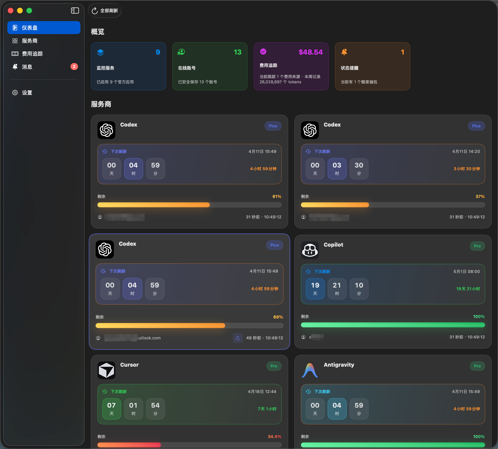
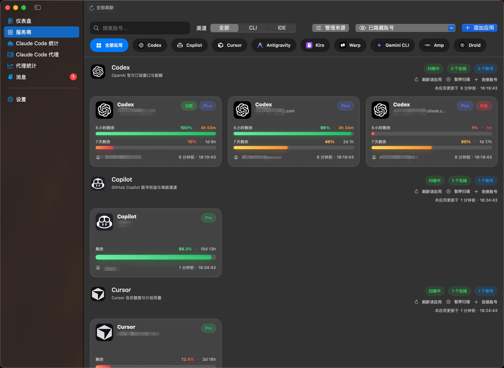
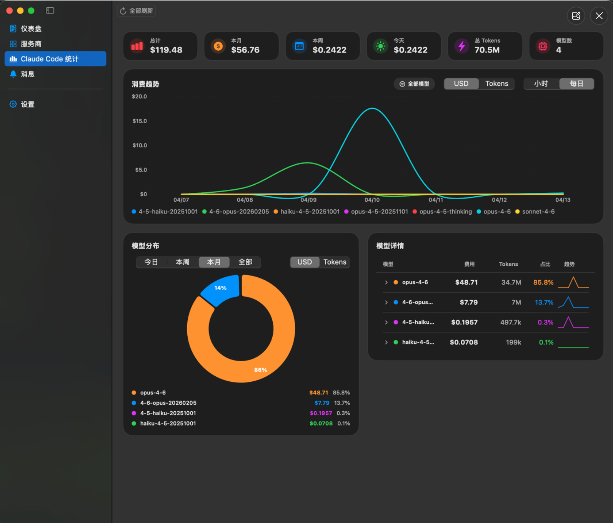
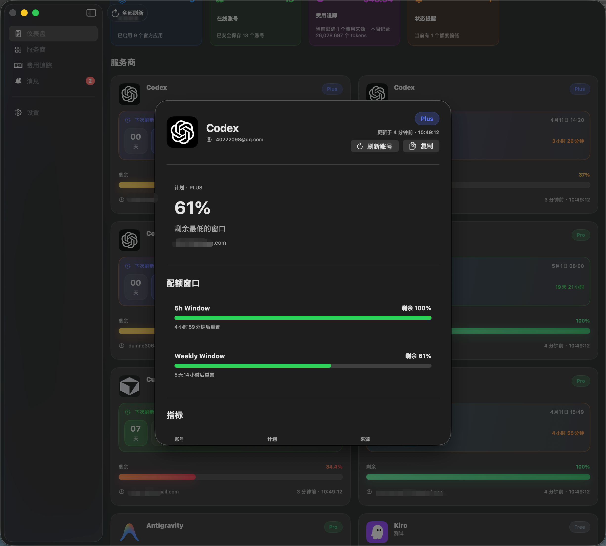
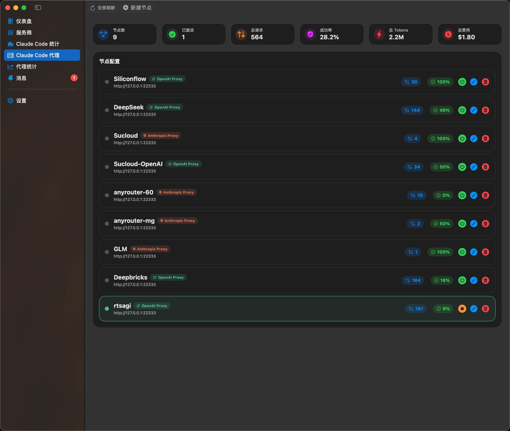
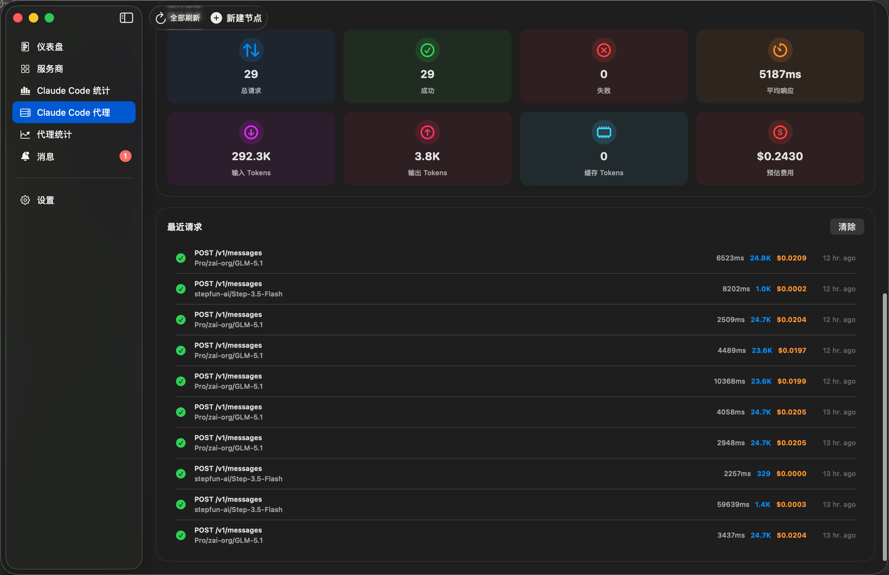
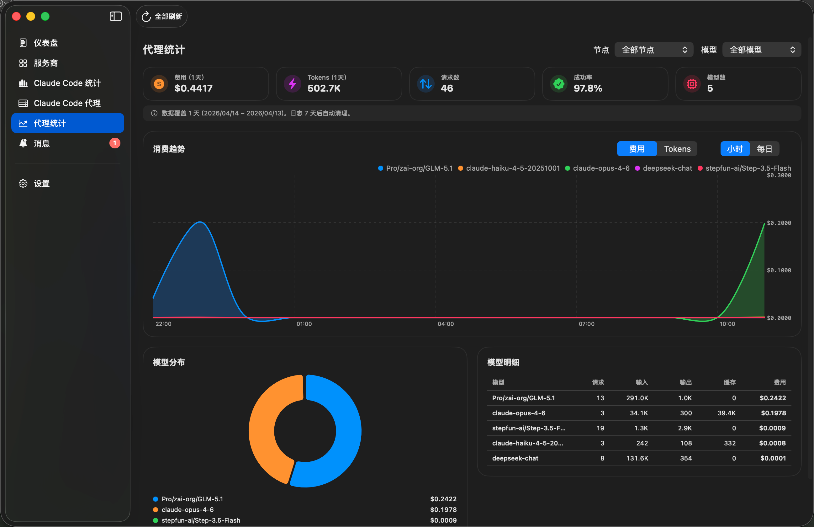
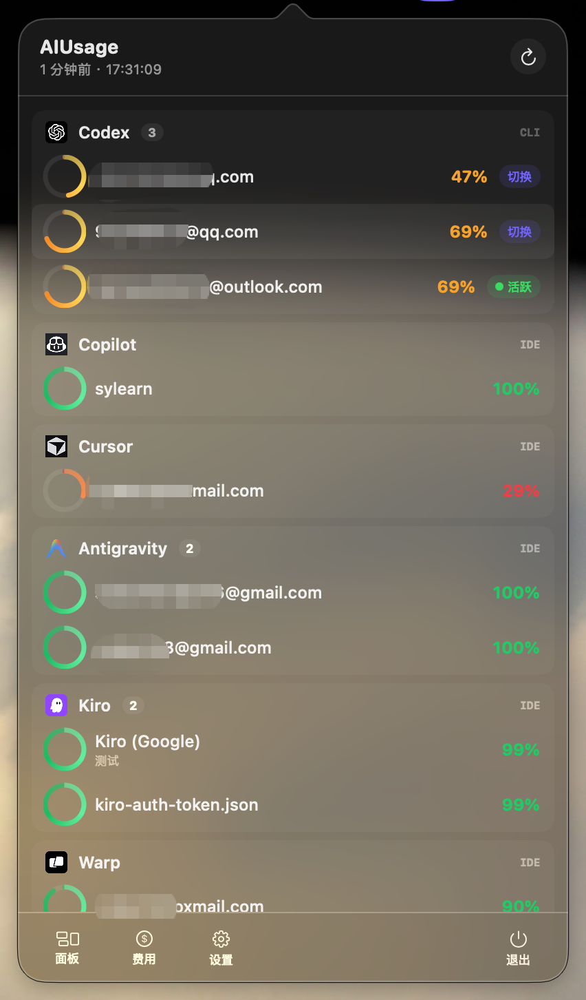

# AIUsage

<p align="center">
  
</p>

<p align="center">
  <strong>一个本地优先的 macOS AI 用量看板，用来统一查看额度、账号状态和花费趋势。</strong>
</p>

<p align="center">
  <a href="README.md">English</a> · <strong>中文说明</strong>
</p>

<p align="center">
  
  
  
  
</p>

<p align="center">
  
</p>

AIUsage 是一个 macOS 应用，用于查看 AI 订阅额度、账号状态、刷新窗口，以及本地 usage 成本。

## 功能

| 功能 | 说明 |
| --- | --- |
| `10+ AI 服务商` | Codex、Copilot、Cursor、Antigravity、Kiro、Warp、Gemini CLI、Amp、Droid、Claude Code — 全部集中在一个看板 |
| `多账号管理` | 同一服务商下多个账号独立刷新，支持 Codex / Gemini CLI 一键切换活跃账号 |
| `Codex 双窗口额度` | 5 小时剩余 + 7 天剩余并排展示，各有独立重置倒计时 |
| `Claude Code 统计` | 按模型拆分费用与 Token（input/output/cache），多模型对比曲线，按时段（今日/本周/本月/全部）分析 |
| `Claude Code 代理` | 协议转换层，支持 OpenAI 转换和 Anthropic 透传两种模式，含模型定价、用量日志和代理统计面板 |
| `菜单栏快览` | 迷你进度环 + 费用 + 活跃账号徽标 + 一键切换，无需打开主窗口 |
| `凭证保险库` | 受管凭证存入 macOS Keychain，文件型凭证由应用托管 |

## 界面预览

<table>
  <tr>
    <td width="50%">
      
    </td>
    <td width="50%">
      
    </td>
  </tr>
  <tr>
    <td align="center"><strong>仪表盘总览</strong></td>
    <td align="center"><strong>服务商与多账号监控</strong></td>
  </tr>
  <tr>
    <td width="50%">
      
    </td>
    <td width="50%">
      
    </td>
  </tr>
  <tr>
    <td align="center"><strong>Claude Code 统计 — 模型级分析</strong></td>
    <td align="center"><strong>账号详情页</strong></td>
  </tr>
  <tr>
    <td width="50%">
      
    </td>
    <td width="50%">
      
    </td>
  </tr>
  <tr>
    <td align="center"><strong>代理节点管理</strong></td>
    <td align="center"><strong>代理节点配置</strong></td>
  </tr>
  <tr>
    <td width="50%">
      
    </td>
    <td width="50%">
      
    </td>
  </tr>
  <tr>
    <td align="center"><strong>代理统计 — 模型级分析</strong></td>
    <td align="center"><strong>菜单栏快览</strong></td>
  </tr>
</table>

## 当前支持

### 订阅 / 配额类来源

`Codex` · `Copilot` · `Cursor` · `Antigravity` · `Kiro` · `Warp` · `Gemini CLI` · `Amp` · `Droid`

### Claude Code 统计

`Claude Code` 本地花费账本，支持模型级费用拆分、input/output Token 细分、多时段分析

## 安装方式

直接从 `Releases` 页面下载最新 macOS 安装包。

提供的发布产物：

- `.dmg`
- `.zip`

## 文档

- [架构总览](docs/ARCHITECTURE.md)
- [Claude Code Proxy 计划](docs/claude-code-proxy-plan.md)
- [Proxy UI 实现文档](docs/proxy-ui-implementation.md)
- [Claude Code Proxy 使用指南](#claude-code-proxy)

## Claude Code Proxy

AIUsage 内置了 Claude Code 代理功能，允许你使用 Claude Code CLI 配合任何 OpenAI 兼容的后端。

### 快速开始

1. 设置环境变量：
```bash
export OPENAI_API_KEY=sk-your-openai-key
export OPENAI_BASE_URL=https://api.openai.com/v1  # 可选
export BIG_MODEL=gpt-4o                            # 映射到 opus
export MIDDLE_MODEL=gpt-4o                         # 映射到 sonnet
export SMALL_MODEL=gpt-4o-mini                     # 映射到 haiku
```

2. 启动代理服务器：
```bash
cd QuotaBackend
swift run QuotaServer --port 4318
```

3. 使用 Claude Code 连接代理：
```bash
ANTHROPIC_BASE_URL=http://127.0.0.1:4318 claude
```

### 功能特性

- ✅ **OpenAI 代理** — 将 Claude API 转换为 OpenAI 兼容后端（DeepSeek、Azure、Ollama 等）
- ✅ **Anthropic 透传** — Anthropic API 透明代理，完整记录用量日志
- ✅ **代理统计面板** — 按模型的费用/Token 趋势、分布图、数据范围感知
- ✅ 完整的 Claude Messages API 支持（`/v1/messages`），含流式 SSE
- ✅ Tool use / 函数调用 / 图片支持
- ✅ 按模型配置价格（USD/CNY），支持自定义模型匹配
- ✅ 多节点管理，一键激活切换
- ✅ 客户端 API Key 认证，安全可控

### 配置说明

所有配置通过环境变量完成：

| 变量 | 必需 | 默认值 | 说明 |
|------|------|--------|------|
| `OPENAI_API_KEY` | 是 | - | 上游 API 密钥 |
| `OPENAI_BASE_URL` | 否 | `https://api.openai.com/v1` | 上游服务地址 |
| `BIG_MODEL` | 否 | `gpt-4o` | Claude Opus 对应的模型 |
| `MIDDLE_MODEL` | 否 | `gpt-4o` | Claude Sonnet 对应的模型 |
| `SMALL_MODEL` | 否 | `gpt-4o-mini` | Claude Haiku 对应的模型 |
| `ANTHROPIC_API_KEY` | 否 | - | 期望的客户端 API 密钥（用于认证）|

### 测试

运行测试套件：
```bash
cd QuotaBackend
swift test
```

所有 21 个测试应该全部通过，包括：
- HTTP 服务器增强（POST、请求头、流式响应）
- 模型规范化和映射
- Claude ↔ OpenAI 协议转换
- 配置验证
- Token 估算

### 架构

代理系统包含：
- **HTTP 服务器**：增强的 `QuotaHTTPServer`，支持 POST、请求头和 SSE 流式响应
- **数据模型**：完整的 Claude 和 OpenAI API 模型
- **转换器**：双向协议转换
- **配置系统**：基于环境变量的配置和验证
- **上游客户端**：用于 OpenAI 兼容后端的 HTTP 客户端
- **代理服务**：协调认证、转换和转发

详细实现说明请参见 [Claude Code Proxy 计划](docs/claude-code-proxy-plan.md)。

## 致谢

灵感参考自 [`CodexBar`](https://github.com/steipete/CodexBar) 与 [`Quotio`](https://github.com/nguyenphutrong/quotio)。

## 友链

- [Linux.do 社区](https://linux.do)

## 许可证

本项目使用 [Apache License 2.0](LICENSE) 许可证。
