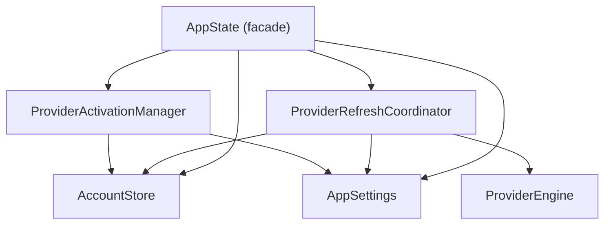
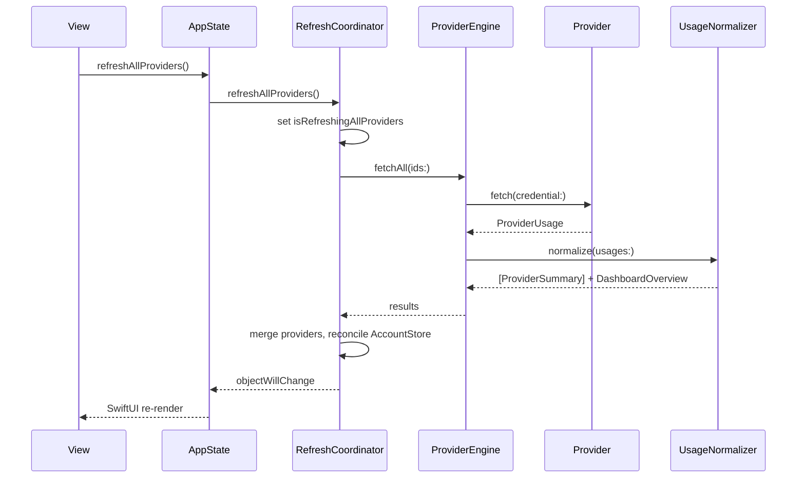

# AIUsage Architecture

## Overview

AIUsage is a macOS-native SwiftUI application that monitors AI subscription quotas across multiple providers, with an integrated Claude Code proxy for using third-party models. The codebase consists of two main modules: the **AIUsage app** (SwiftUI frontend + state management) and the **QuotaBackend** SwiftPM package (provider engines, normalizers, proxy runtime).

## Directory Structure

```
AIUsage/
├── AIUsageApp.swift              # @main, scene setup, EnvironmentObject wiring
├── Models/
│   ├── AppState.swift            # Thin facade: UI navigation + coordinator references
│   ├── AppSettings.swift         # UserDefaults-backed preferences (ObservableObject)
│   ├── AccountStore.swift        # Account registry & credential management
│   ├── ProviderModels.swift      # App-side ProviderData, alerts, etc.
│   └── ProxyConfiguration.swift  # Proxy node config model
├── Services/
│   ├── APIService.swift          # HTTP client for remote QuotaServer
│   ├── SecureAccountVault.swift  # Keychain read/write for account metadata
│   ├── ProviderAuthManager.swift # Auth flow orchestration (slim router)
│   └── ProviderAuth/
│       ├── ProviderAuthTypes.swift
│       ├── ProviderManagedImportStore.swift
│       ├── CLIExecutableResolver.swift
│       ├── CodexLoginCoordinator.swift
│       ├── GeminiLoginCoordinator.swift
│       ├── ProviderAuthCandidateDiscovery.swift
│       └── ProviderAuthParsing.swift
├── ViewModels/
│   ├── ProviderRefreshCoordinator.swift  # Refresh engine, timers, data pipeline
│   ├── ProviderActivationManager.swift   # CLI active account detection
│   └── ProxyViewModel.swift              # Proxy node lifecycle & process management
└── Views/
    ├── ContentView.swift           # NavigationSplitView shell
    ├── DashboardView.swift         # Main dashboard
    ├── ProviderCard.swift          # Rich quota card UI
    ├── CostTrackingView.swift      # Claude Code cost charts
    ├── ProxyManagementView.swift   # Proxy node list
    ├── ProxyStatsView.swift        # Proxy usage statistics
    ├── SettingsView.swift          # Preferences UI
    └── ...

QuotaBackend/Sources/
├── QuotaBackend/
│   ├── ProviderProtocol.swift    # Core protocols & types
│   ├── Engine/
│   │   ├── ProviderEngine.swift          # Concurrent provider orchestration
│   │   ├── ProviderRegistry.swift        # Static provider list
│   │   ├── AccountCredentialStore.swift  # Keychain credential storage
│   │   └── BrowserDiscovery.swift        # Browser profile helpers
│   ├── Providers/
│   │   ├── ClaudeProvider.swift    # Local JSONL log scanner
│   │   ├── CodexProvider.swift     # OpenAI Codex API
│   │   ├── CopilotProvider.swift   # GitHub Copilot
│   │   ├── CursorProvider.swift    # Cursor IDE
│   │   ├── GeminiProvider.swift    # Google Gemini CLI
│   │   ├── AmpProvider.swift       # Amp
│   │   ├── DroidProvider.swift     # Droid
│   │   ├── KiroProvider.swift      # Kiro
│   │   ├── WarpProvider.swift      # Warp
│   │   └── AntigravityProvider.swift
│   ├── Normalizer/
│   │   ├── UsageNormalizer.swift   # Raw → ProviderSummary + DashboardOverview
│   │   └── ProviderSummary.swift   # Normalized summary structs
│   ├── ClaudeProxy/
│   │   ├── Runtime/                # Proxy service, upstream client
│   │   ├── Conversion/            # Claude <-> OpenAI format converters
│   │   ├── Models/                # API model definitions
│   │   └── Utilities/             # SSE encoder
│   └── Utilities/
│       └── DateFormatting.swift   # Shared formatters (SharedFormatters, DateFormat)
└── QuotaServer/
    ├── main.swift                 # CLI entry point
    └── QuotaHTTPServer.swift      # NWListener HTTP server
```

## Singleton Architecture



| Singleton | Responsibility |
|-----------|---------------|
| **AppState** | UI navigation state, selected providers, read-through forwarding, `objectWillChange` aggregation |
| **AppSettings** | UserDefaults-backed preferences: theme, language, refresh intervals, backend mode |
| **AccountStore** | Account registry, credential lifecycle, normalization/dedup, Keychain persistence |
| **ProviderRefreshCoordinator** | Refresh timers, `ProviderEngine` orchestration, local/remote fetch, data merging |
| **ProviderActivationManager** | CLI active account detection (Codex/Gemini), auth file I/O |

All singletons forward `objectWillChange` to `AppState`, so views observing `@EnvironmentObject var appState` refresh automatically.

## Data Flow: Provider Refresh



## Proxy Subsystem

**Process lifecycle** (managed by `ProxyViewModel`):

1. User activates a proxy node in the UI
2. `ProxyViewModel` writes `~/.claude/settings.json` with proxy endpoint + model env vars
3. Spawns `QuotaServer` process with appropriate environment variables
4. Pipes stdout/stderr, parses `PROXY_LOG:` JSON lines for stats
5. On deactivation: kills process, restores settings.json

**Proxy modes**:
- **OpenAI Proxy**: Claude API requests → converted to OpenAI format → upstream provider
- **Anthropic Passthrough**: Transparent proxy logging input/output/cache tokens without format changes

## Storage Locations

| Location | Content |
|----------|---------|
| **UserDefaults** | App preferences, selected providers, proxy configurations, stats |
| **Keychain** (`SecureAccountVault`) | Account registry metadata (emails, notes, IDs) |
| **Keychain** (`AccountCredentialStore`) | Provider credentials (cookies, tokens, API keys) |
| `~/.claude/settings.json` | Claude Code configuration (managed env vars + model) |
| `~/.config/aiusage/proxy-logs.json` | Proxy request logs (with day-based retention) |
| `~/.config/aiusage/proxy-pricing.json` | Model pricing overrides |
| `~/.config/claude/projects/**/*.jsonl` | Claude Code usage logs (read-only by ClaudeProvider) |

## Supported Providers

| ID | Provider | Channel | Auth Method |
|----|----------|---------|-------------|
| codex | Codex (OpenAI) | CLI | `codex login` flow |
| copilot | GitHub Copilot | IDE | Browser session / gh CLI |
| cursor | Cursor | IDE | Browser session |
| antigravity | Antigravity | IDE | Browser session |
| kiro | Kiro | IDE | Auth file |
| warp | Warp | IDE | Auth file |
| gemini | Gemini CLI | CLI | Google OAuth |
| amp | Amp | CLI | Browser session |
| droid | Droid | CLI | Browser session / API |
| claude | Claude Code Spend | Local | JSONL log scan |

## CI/CD

Single GitHub Actions workflow (`.github/workflows/release.yml`):
- **Trigger**: push tag `v*.*.*` or manual dispatch
- **Steps**: checkout → validate version consistency (Info.plist + project.pbxproj + tag) → SPM resolve → build release → sign with Sparkle → upload DMG/ZIP → publish GitHub Release → update appcast.xml

**Version must match in three places**: `Info.plist` (CFBundleShortVersionString + CFBundleVersion), `project.pbxproj` (MARKETING_VERSION), and Git tag.
